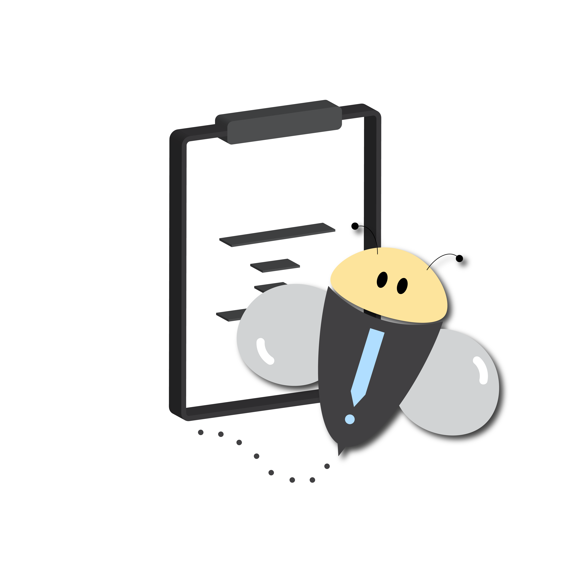

# BEENOTES

**BEENOTES** is a open source Task management mobile application, help you improve your productivity,
All data will completly store locally and you can chose a bacup method like a google drive, one drive, etc.

# LICENSE
BEENOTES is a free software;you can redistribute it and/or midfiy it under the terms of the GNU Affer General Public License v3 (AGPL-3.0-or-later) as published by the Free Software Foundation

BEENOTES include some [External Flutter Packages](./pubspec.yaml) that carry their own licensing.
